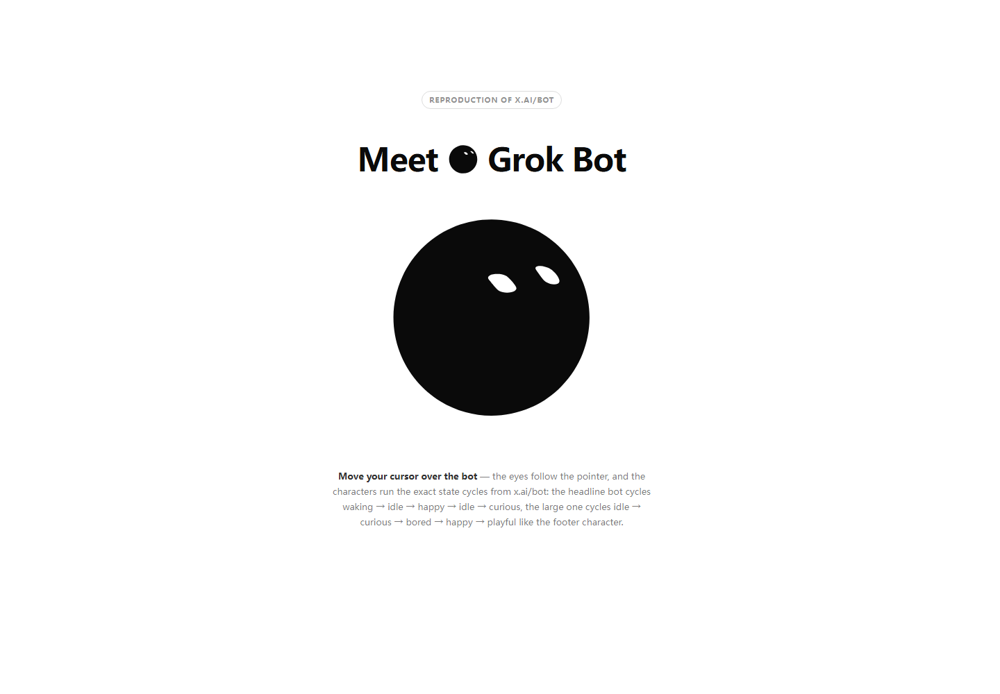

# Grok Bot — 交互式机器人图标

一个**自包含、零依赖**的纯技术展示：会动、眼睛会跟着鼠标走的 **Grok 机器人图标**。打开一个文件，把鼠标移到机器人身上，就能看到眼睛平滑追踪光标，同时角色循环切换各种情绪状态。

| | |
|---|---|
| 产物 | 单个 `index.html` —— React 已内联，无需服务器 / CDN，`file://` 双击即开 |
| 技术 | SVG + React + 微型弹簧物理动画引擎 |
| 说明 | 对 [x.ai/bot](https://x.ai/bot) 中 Grok 机器人图标的忠实复刻；美术版权归 xAI |



## 演示

用浏览器打开 [`index.html`](index.html)（双击即可），然后**把鼠标移到机器人身上**——眼睛会平滑跟随指针，同时角色循环切换情绪状态：

- 标题处机器人循环 `waking → idle → happy → idle → curious`
- 大号机器人循环 `idle → curious → bored → happy → playful`

## 特性

- **光标跟随**——眼睛通过临界阻尼弹簧物理平滑追踪鼠标，而非线性补间
- **30+ 种情绪状态**——`idle`、`happy`、`curious`、`bored`、`sleeping`、
  `waking`、`thinking`、`angry`……以及智能体形态（`orbit`、`radar`、
  `progress`）和产品生命周期状态（`writing`、`sending`、`receiving`、
  `notifying`……）
- **25 种眼睛表情**，通过逐点环插值互相"融化"过渡
- **环形特效**——思考气泡点、轨道、雷达、进度环、彩带迸发、旋转、弹跳
- **支持减弱动态效果**（`prefers-reduced-motion`）
- **完全离线**——零外部请求

## 实现原理

这个图标**不是 CSS 动画**，而是一个数据驱动的 SVG 组件加一个微型物理引擎，所有动画都在同一个 `requestAnimationFrame` 循环里完成。共四层：

### 1. 形状与表情都是"数据"（`src/shapes-module.js`）

- **表情**——25 种眼睛轮廓，每种存为**点环**（每只眼约 50 个 `[x, y]`采样点）
- **几何工具**——`HEAD_C = 114.2705`（viewBox 中心）、`centroid`（质心）、`lerpRing`（两个点环逐点插值）、`ringPath`
- **形状**——17 种头部轮廓（`blob`、`bean`、`cloud`、`shield`、`hex`……）。
  每种由构建器 `E()` 生成：
  - 把轮廓归一化到头部坐标系
  - 光线投射生成 **96 点可插值环**
  - 预计算 `top` / `bottom` / `spanAt(y)` 查找表，供每帧快速裁剪眼睛
  - **暴力搜索"眼睛放哪里最好看"**（在尽量贴近中心的前提下最大化眼睛面积）

### 2. 运动是"物理"（`src/grokbot-module.js`）

- 每个动画属性都是一个**弹簧对象** `{ x, v, t }`，用临界阻尼弹簧积分：
  `v += (−2ζω·v − ω²(x − target))·dt`，固定步长 `1/120 s`
- **状态机**通过 `f`、`A`、`m` 三张表把状态映射到表情索引与随机时长；每个状态的 case 用时间正弦组合设置弹簧目标——例如 `happy` 把眼睛挤成弯月`waking` 先眯眼再瞪开并迸发彩带
- **`requestAnimationFrame` 循环**每帧根据插值后的点环重新生成头 / 眼路径，并**直接通过 ref 写 SVG 属性——动画期间 React 从不重渲染**
- **粒子系统**在隐藏图层上生成彩色彩带 / 星星

### 3. 交互

`mouseInteractive` 开启时，`pointermove` 监听器把光标坐标写入 ref；循环把它映射成视线方向（限制在头部宽度 ±0.6 以内），弹簧平滑后的偏移量驱动眼睛的`transform`。

### 4. 颜色来自 CSS 变量

SVG 使用 `.grok-bot-mark__head { fill: var(--fg) }` 与`.grok-bot-mark__eye { fill: var(--bg) }`；页面提供 `--fg` / `--bg`（`hsl(var(--primary))` / `hsl(var(--background))`），因此图标自动继承宿主页面的主题色。

## 目录结构

```
grok-bot-icon/
├── index.html              # 展示成品——自包含，双击即运行
├── preview.png             # README 用截图
├── src/
│   ├── shapes-module.js    # 注释版：形状 + 表情 + 几何工具
│   └── grokbot-module.js   # 注释版：动画引擎
├── README.md               # English
└── README.zh-CN.md         # 本文件
```

## 阅读注释版源码的建议

- `src/shapes-module.js`——先看文件头注释，再看 `E()`（形状构建器）和`SHAPES` 目录
- `src/grokbot-module.js`——先看文件头注释，再看**逐状态运动 `switch`**、弹簧积分器 `k()` 和 `requestAnimationFrame` 循环 `eU()`

单字母变量名被有意保留，以便注释版源码与生产实现一一对应、可追溯。

## 版权说明

美术与动画引擎是对 [x.ai/bot](https://x.ai/bot) 中 Grok 机器人图标的忠实复刻，版权归 xAI 所有。本项目为独立技术展示，仅供学习参考——请勿将美术资源用于商业分发。详见 [LICENSE](LICENSE)——**保留所有权利**。
